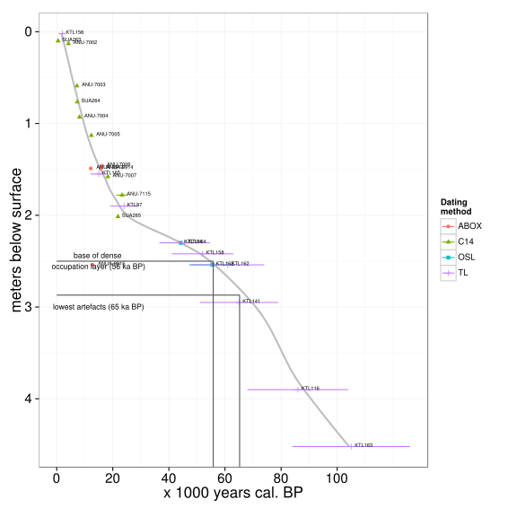

## Supplementary details supporting the analysis of OSL and C14 dates, lithics and shellfish from the 1989 excavations at Madjebebe (Malakanunja II)

#### Ben Marwick, benmarwick@gmail.com

This document contains the source code used to generate the plots and statistics presented in the manuscript. It is provided to give the reader additional insight into the data analysis workflow and allow anyone to reproduce our analysis and further explore the analyses and data for themselves. 

```{r, echo = FALSE}
library(knitr)
opts_chunk$set(fig.width = 7, messages = FALSE, warning = FALSE)
```

### OSL and C14 dates

```{r read-in-dates-data}
library(mjb1989excavationpaper)
chrono_data <- get_chrono_data()
```


```{r clean-up-dates}
chrono_data_tidied <- tidy_chrono_data(chrono_data)
```


```{r interpolate}
chrono_data_interpolated <- interpolate_chrono_data(chrono_data_tidied)
```

```{r plot-dates, results='asis'}
chrono_data_plotted <- plot_chrono_data(chrono_data_tidied, 
                        oldest_depth = chrono_data_interpolated$oldest_depth,
                        oldest = chrono_data_interpolated$oldest,
                        base_of_dense_depth = chrono_data_interpolated$base_of_dense_depth,
                        dense = chrono_data_interpolated$dense)
cat("<p>")
```

Based on the TL age estimates and the artefact distribution, Roberts et al. (1990a) suggested first occupation at the site began 55 ± 5 ka. Although the excavators were conservative in their interpretations—stressing the upper (i.e. 50 ka) limit of this age range and taking the lower limit of the high density band of artefacts (2.4 m bs) as the actual level of initial occupation — we confirm here that the lowest artefacts occur in Spit 49, 2.76 – 2.8 m deep below surface and are bracketed by the original OSL age estimate of 55.5 ± 8.2 ka (KTL-162) and the TL estimate of 65 ± 14 ka (KTL-141). Subsequent redating of several of the lower samples at MJB using single grain and single aliquot OSL methods reduced the error ranges for the lower dates substantially, but did not alter the original results (Roberts et al. 1998). 

At the time of Roberts et al.’s (1998) publication and commentary no calibration curve was available for radiocarbon dates greater than 11 ka, and hence the issue of underestimation of calendar years could not be resolved. A calibration curve is now available back to 50 ka (Reimer et al. 2013). The IntCal13 calibration curve results in a calibrated age for the 13.39 ka age (ANU-7006) as 15,001 – 17,429 cal BP, overlapping at 1σ with the TL age of 15 ± 3 ka (KTL-165) at equivalent depth. Kamminga and Allen’s (1973) 18.04 ka age (SUA-265)    calibrates to c. 22.4 - 21.0 ka, overlapping at 1σ with the TL age of 24 ± 5 ka (KTL-97) at equivalent depth. The 14.9 ka age (ANU-7007) provided by Roberts et al. (1998) calibrates to 18.5 - 17.8 ka, and remains within 1σ of the TL age of KTL-97. These new calibrations show that conventional radiocarbon years do substantially under-estimate the ages of the sediments and that calendar ages show a strong correlation with luminescence ages. 

```{r difference-in-slope-plot}
chrono_data_slopes_plot <- plotting_slopes_chrono_data(chrono_data_tidied)
# show plot
chrono_data_slopes_plot$the_plot
```

Plotting the linear regression lines for OSL/TL ages against radiocarbon ages suggests that the slopes of the lines are not the same. We can explore this further by comparing the models directly.

```{r difference-in-slope-1}
anova_p_value <- testing_slopes_chrono_data(chrono_data_slopes_plot$dates_1989)
```

Computing a linear model with depth and age using the two dating methods as a cross to test for interaction between them gives a significant difference, with a p-value of `r anova_p_value`. 

```{r  difference-in-slope-2}
ancova_p_values <- ancova_slopes_chrono_data(chrono_data_slopes_plot$dates_1989)
# show the plot
ancova_p_values$the_plot
```

If we restrict the sample to just the dates in the upper 2 m, which is the depth of the lowest in-sequence radiocarbon date (SUA-265), we can more robustly compare the ages from radiocabon and luminesensce methods. 

In the ANCOVA model, age is modeled as the dependent variable with depth as the factor and dating method as the covariate. The summary of the results show a significant effect of depth (p = `r ancova_p_values$a1`), but no significant interaction between dating methods (p = `r ancova_p_values$a2`). These results suggest that the slope of the regression between age and depth is similar for both dating methods.

```{r difference-in-slope-3}
anova_p_values <- anova_slopes_chrono_data(ancova_p_values$upper, ancova_p_values$m2)
```

We can fit a more parsimonious model without the interaction to test for significant differences in slope. We can compare the two models for each dating method with ANOVA to assess if removing the interaction significantly affects the fit of the model. The result is that removing the interaction does not significantly effect the fit of the model. There is still no significant effect of dating method on the slope of the age-depth lines (p = `r anova_p_values`)

```{r difference-in-slope-bayes-1} 
bayes_values <- bayes_slopes_chrono_data(ancova_p_values$upper)
```

```{r difference-in-slope-bayes-2, eval = FALSE}
# Warning - very time consuming, >30 min
# bayes_test_values <- bayes_test_slopes_chrono_data(bayes_values$x1_post, bayes_values$x2_post)
```

```{r paste-in-results}
# since the MCMC is quite time consuming,I've included the output
# from a run so we can use that rather than redo the analysis. To
# redo the analysis, simply run the code in the previous chunk.
load("data/slopes_test.rda")
# This requires the summary.BEST from BEST
library("BEST")
summary(slopes_test)
best1 <- round(BEST:::summary.BEST(slopes_test)[3], 2)
best2 <- round(unname(BEST:::summary.BEST(slopes_test)[3, 5:6]),2)
```

Smith and Jones obtained several more radiocarbon dates that have not been previously published (Table 1), increasing the number of available radiocarbon ages for the site to 13. With the exception of one anomalous age from the base of the sequence already discussed above (ANUA-9915), the additional 14C ages provide a picture of consistent depth-age relationships between radiocarbon and luminescence techniques down to two meters below the surface (the depth of the lowest in-sequence radiocarbon date). A test of the difference between the correlation coefficients for the linear regression slopes for 14C and luminescence ages indicates no significant difference between slopes, indicating that both provide effectively identical age-depth relationships for the uppermost two meters of deposit (Bayesian estimation of difference in means = `r best1`, 95% HDI = `r best2`, the interval includes zero, indicating no credible difference). Concerns over the degree of fit between 14C and luminescence chronologies for the upper half of the deposit can no longer be sustained (cf. Bowdler 1990; Hiscock 1990).


```{r change-point-analysis}
#### bayesian change point analysis on sedimentation rates
bayes_cp_result <- bayes_cp_test(chrono_data_slopes_plot$dates_1989)
```

Bayesian change point analysis indicates that sedimentation rates slow substantially below 2.0 m to the base of occupation (posterior probability of change is  `r round(bayes_cp_result$hi_probs[1,]$"cp$posterior.prob",3)` at `r round(bayes_cp_result$hi_probs[1,]$age2plot,0)` ka cal BP) and then accelerate again below the lowest occupation (posterior probability of change is `r round(bayes_cp_result$hi_probs[2,]$"cp$posterior.prob",3)` at `r round(bayes_cp_result$hi_probs[2,]$age2plot,0)` ka).

```{r sed-rates-15-20-ka}
# check 15 – 20 ka sedimentation rates
# examine slope from KTL97 through KTL165 compare C14 to OSL
# now limit for depth range KTL97 through KTL165

sed_rates_15_to_20_result <- sed_rates_15_to_20(chrono_data_slopes_plot$dates_1989)
# plot
sed_rates_15_to_20_result$the_plot
```

```{r bayesian-slope-diff}
bayes_slope_posteriors <- bayes_slope_difference(sed_rates_15_to_20_result$sub_OSL,
                                                 sed_rates_15_to_20_result$sub_C14)
```

```{r another-mcmc, eval=FALSE}
# rather time consuming, >30 min
# bayes_slope_difference_result <- bayes_slope_test(bayes_slope_difference_result$x1_post,
#                                                bayes_slope_difference_result$x2_post)
```

```{r paste-in-results-again}
# since the MCMC is quite time consuming,I've included the output
# from a run so we can use that rather than redo the analysis. To
# redo the analysis, simply run the code in the previous chunk.
load("data/slopes_test_sub.rda")
BEST:::summary.BEST(slopes_test_sub)
# print(slopes_test_sub)
# plot(slopes_test_sub)
# windows()
# plotAll(slopes_test_sub, credMass=0.8, ROPEm=c(-0.1,0.1), 
#         ROPEeff=c(-0.2,0.2), compValm=0.5) 
# pairs(slopes_test_sub)

```

Sedimentation rates indicated by 14C and OSL ages during the period 15 – 20 ka, just before the first major change in sedimentation rates, are not credibly different (Bayesian estimation of difference in means = `r round(summary(slopes_test_sub)[3], 2)`, 95% HDI = `r round(unname(summary(slopes_test_sub)[3, 5:6]),2)`, the interval includes zero, indicating no credible difference). Although there are no reliable 14C ages older than 20 ka, the lack of difference in rates between the two methods before this time suggests that the change in sedimentation rates was a real event, rather than an effect of changes in the age-depth relationship between 14C and luminescence methods. The depth-age curve also allows us to estimate the likely age of the lowest artefact as approximately 64 ka, and the base of the dense artefact layer as approximately 55 ka (though it must be acknowledged, that the error ranges on these lowest luminescence ages are large). Any possible refinement of temporal resolution cannot be addressed prior to analysis of new samples collected in 2012. Non-local stone in the form of silcrete is present from Spit 47 (2.9m bs), suggesting human activity at this level, but artefact numbers do not increase markedly until Spit 45. 


### Lithics

```{r load-lithic-data, echo=FALSE}
library(mjb1989excavationpaper)
lithics_data <- get_lithics_data()
```

```{r clean-data}
# Now onto the lithic data...
lithics_data_cleaned <- clean_lithics_data(lithics_data)
```

```{rplot-data}
lithics_data_plotted <- plots_lithics_data(lithics_data_cleaned,  bayes_cp_result$cal.date.lo)
lithics_data_plotted$p1
# figures/Fig_6_lithics_over_time_from_1989_for_paper.svg
```

Stone artefacts are present in every spit of the 1989 excavation at MJB (Figure 6, Table 2). These show distinct pulses of accumulation, centred around 5, 7, 12.5, 18.4, 36, and 45 – 52 ka (Figure 6). Between Spits 37 – 39 (2.2 – 2.4 m bs) there are 1900 flaked stone artefacts from the 7 mm sieve (including 41 of exotic chert), numerous pieces of high-grade haematite (totalling 4.92 kg, including seven ground pieces), 143 g of red or yellow ochre, pieces of dolerite (presumed to be fragments of edge-ground axes) and fragments of grindstones; a further 568 flaked stone artefacts and 344 pieces of haematite were recovered from the pit fill at this level. All of these are associated with, or are slightly beneath, a TL age of 45 ± 9 ka. Beneath this, in levels dating 52 ± 11 to 61 ± 13 ka there were an additional 82 flaked stone artefacts and 52 pieces of haematite recovered from the 7 mm sieve. This is a comparatively large assemblage from a trench measuring only 1 x 1.5 m. It is unlikely the quartzite stone artefacts derive from downward displacement of artefacts from the predominately quartz assemblage that overlies it.  

```{r raw-materials}
lithics_rawmaterials_plotted <- plots_lithics_rawmaterials(lithics_data, 
                                                           lithics_data_plotted$spit, 
                                                           bayes_cp_result$cal.date.pr)                                                     
```


```{r strat-plot}
lithics_rawmaterials_stratplotted <- stratiplot_lithics(lithics_rawmaterials_plotted$plot2)
# figures/Fig_9_stratplot.png
```


```{r lens-raw-materials}
lens_differences_raw_plot <- lens_differences_raw()
raw_fish_pval <- formatC(round(lens_differences_raw_plot$raw_chi_fisher$p.value, 4), big.mark=",",format="f", drop0trailing = TRUE)
```

```{r lens-tech-difference}
lens_differences_tech_plot <- lens_differences_tech()
tech_fish_pval <- round(lens_differences_tech_plot$tech_chi_fisher$p.value, 3)
```

```{r lens-tech-and-raw-plot, results = "asis"}
lens_tech_and_raw_plot <- combine_lens_plots(lens_differences_tech_plot$p1,lens_differences_raw_plot$p1)
lens_tech_and_raw_plot
cat("<p>")
```


Chi square tests indicate that the differences in raw material proportions between all three assemblages are highly significant (p = `r raw_fish_pval`), although the differences in technological composition are not significant (p = `r tech_fish_pval`), most likely due to small sample size (n = 10 for types in the assemblage below the lens).  


## Shellfish

```{r shell-plot}
shell_data_plotted <- plot_shell_data()
shell_data_plotted
```

### R Session Information

```{r}
sessionInfo()
```

